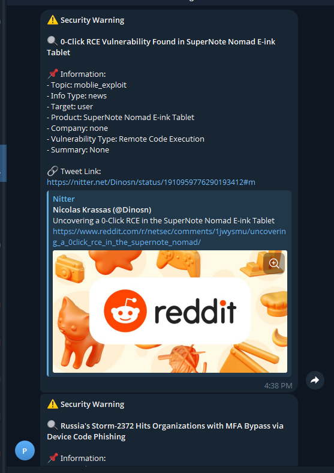

# My Journey Building a Security Assistant

As a security expert, I always feel overwhelmed by an ocean of information. Every day, hundreds of tweets about new vulnerabilities, exploits, and security research are posted. Initially, I tried to monitor manually - constantly checking X (Twitter), reading each tweet, trying to assess importance and decide if immediate action was needed. But I realized this wasn't feasible.

There were mornings when I woke up to find the whole world discussing a serious vulnerability I hadn't heard about. I wondered: "How can I not miss important information? How can I rest while still keeping track of everything?"

And so the idea of a virtual assistant was born. An assistant that could monitor security experts 24/7 on my behalf, analyze each tweet and only wake me up when truly necessary.

## Meet Claude - My Analysis Assistant

After experimenting with different approaches, I chose Claude as the "brain" for my assistant. Claude isn't just a regular AI - it has the ability to understand context and evaluate information subtly. I spent weeks "training" Claude how to analyze tweets: distinguishing between a serious vulnerability and regular news, assessing the prevalence of affected products, and most importantly, knowing when to raise an alarm.

## Telegram - A Reliable Notification Channel

After having Claude for analysis, I needed an effective notification channel. Email was too slow, SMS too expensive. Telegram became the perfect choice - fast, stable and capable of beautiful message formatting. Whenever Claude detects something important, a message is sent immediately to my phone, formatted clearly with HTML so I can quickly grasp important information.

Now, I can focus on work or rest easy, knowing there's a team of "virtual employees" working tirelessly. They monitor, analyze and only notify when truly necessary. That's exactly what I needed - a smart, reliable assistant working 24/7.

## Technology Choices - Challenges and Solutions

Collecting data from X (Twitter) was a major challenge. I experimented with several methods:

### Twitter API - High Cost and Limitations
Initially, I tried the official Twitter API. It provides reliable and realtime data, but costs too much for continuous monitoring. At $100/month for basic API and request limits, this wasn't viable for a personal project.

### RSS Feed - No Longer Supported
RSS used to be a great solution for monitoring Twitter. Simple, lightweight and completely free. However, Twitter stopped supporting RSS feeds in 2023, making this option no longer viable.

### Nitter API - Unstable
Nitter - an alternative Twitter frontend, provides free API and RSS feed. I experimented but encountered many issues:
- Many instances frequently blocked
- Unstable speed
- Data sometimes missing or not updated timely

### Final Solution - Selenium with Nitter
After much testing, I decided to combine Selenium with Nitter. Selenium allows automating real browsers, while Nitter helps access Twitter data without official API.

The biggest challenge was bypassing Cloudflare - Nitter's anti-bot protection system. Regular Selenium is usually detected and blocked. The solution was using undetected-chromedriver, a Selenium variant specially designed to bypass bot detection mechanisms.

Here's the code I use to handle this:
```
    try:
        options = webdriver.ChromeOptions()
        options.add_argument('--headless')
        options.add_argument('--no-sandbox')
        options.add_argument('--disable-dev-shm-usage')
        options.add_argument('--disable-gpu')
        options.add_argument('--window-size=1920,1080')
        
        # Add options to bypass Cloudflare
        options.add_argument('--disable-blink-features=AutomationControlled')
        options.add_experimental_option("excludeSwitches", ["enable-automation"])
        options.add_experimental_option('useAutomationExtension', False)
        
        # Add real user agent
        options.add_argument('user-agent=Mozilla/5.0 (Windows NT 10.0; Win64; x64) AppleWebKit/537.36 (KHTML, like Gecko) Chrome/122.0.0.0 Safari/537.36')
        
        self.driver = webdriver.Chrome(options=options)
        
        # Add JavaScript to hide automation signs
        self.driver.execute_script("Object.defineProperty(navigator, 'webdriver', {get: () => undefined})")
        
        self.logger.info("WebDriver started successfully")
        return True
    except Exception as e:
        self.logger.error(f"Error starting WebDriver: {str(e)}")
        return False
```


### Anthropic API - Direct HTTP Interaction

When working with the Anthropic API, I experimented with two approaches:

#### Python Library - Many Issues Arose
Initially I used Anthropic's official Python library. However encountered some issues:
- Library versions often not updated with new API
- Inflexible error handling 
- Hard to control request parameters
- Sometimes encountered unclear errors

#### HTTP Request - Stable Solution
Finally I chose to interact directly with the API via HTTP requests:
- Complete control over requests/responses
- Easy debugging and error handling
- Flexible parameter customization
- No library version dependencies


### Building Prompts for Claude

When building prompts to analyze tweets, I focused on these elements:

#### 1. Information Structure to Analyze
- Brief title about tweet content
- Topic classification (web_exploit, binary_exploit, malware,...)
- Information type (news, paper, tool,...)
- Attack target (user, server, cloud)
- Product/vulnerability info (product name, company, popularity,...)
- Exploit info (yes/no, URL, summary)

#### 2. Result Format
- Use JSON for easy processing
- Clearly defined information fields
- Handling for irrelevant tweets

#### 3. Detailed Guidelines
- How to classify and evaluate information
- Criteria for determining warning level
- Length limits for information fields

Below is an example prompt I use:


```
"""Please analyze the following tweet and return the result in JSON format:
    Tweet: {tweet_content}
    
    Analysis requirements:
    - Write a short title about the Tweet, no more than 20 words.
    - Classify the content topic into one of: web_exploit, binary_exploit, moblie_exploit, cloud_exploit, malware
    - Classify the information type into one of: news, paper, presentation, tool
    - Target: return the attack target, one of: user, server, cloud
    - If topic is not none:
        - Product name: return the affected product name
        - Company name: return the company owning the product, if opensource return "opensource", if none return "none"
        - Product popularity: return product popularity from 1 to 5 where:
            - 1: Very few people know about it
            - 2: Few people know about it
            - 3: Average. Belongs to small and medium companies/solutions
            - 4: Many people know about it, belongs to large companies but not main products. If opensource, popular product
            - 5: Very many people know about it, belongs to large companies, popular products. If opensource, extremely popular
        - Vulnerability type: return specific vulnerability name like: SQL Injection, Remote Code Execution, etc.
        - Has exploit: return true or false
        - Exploit URL: return exploit access URL
        - Summary: If Exploit URL is avaiable, access link and summary, return a summary of the tweet content, no more than 100 words. 
    - Conclusion: return true or false for warning if:
        - Not news
        - Popular product, level 3 or above
        - Serious vulnerability allowing control takeover
        - In-depth analysis of vulnerability, finding method, exploitation method
    
    Note:
    - If tweet doesn't belong to any topic, return topic as none
    - If tweet doesn't belong to any info type, return topic as none
    - Don't provide any other information, include reason or anything else. I want only JSON format.
    Return JSON with the following format if topic is not none:
    {{
        "title": "title",
        "topic": "topic",
        "info_type": "info_type",
        "target": "target",
        "product_popularity": product_popularity,
        "has_exploit": true of false,
        "exploit_url": "exploit_url",
        "product_name": "product_name",
        "company_name": "company_name",
        "exploit_type": "exploit_type",
        "tweet_url": "tweet_url",
        "is_warning": true of false,
        "summay": "summary"
    }}
    Return JSON with the following format if topic is none:
    {{
        "topic": none
    }}
    """
```
Example of JSON response when tweet contains vulnerability information:

{
    "title": "Critical RCE vulnerability found in Apache Struts 2",
    "topic": "web_exploit", 
    "info_type": "news",
    "target": "server",
    "product_popularity": 5,
    "has_exploit": true,
    "exploit_url": "https://github.com/example/CVE-2023-1234",
    "product_name": "Apache Struts 2",
    "company_name": "opensource",
    "exploit_type": "Remote Code Execution",
    "tweet_url": "https://twitter.com/security_alert/status/123456789",
    "is_warning": true,
    "summary": "Critical RCE vulnerability discovered in Apache Struts 2 affecting versions 2.0.0-2.5.30. Attackers can execute arbitrary code by sending specially crafted requests. Patch available in version 2.5.31."
}

## Sending notifications via Telegram

After getting analysis results from Claude, we need a mechanism to immediately notify users when serious issues are detected. Telegram is an excellent choice for this for several reasons:

- Simple API, easy to integrate
- HTML formatting support for readable messages 
- Fast push notifications to phones
- Completely free for personal use

When Claude analyzes and returns is_warning as True, the system will automatically create a nicely formatted message with important information like:

- Issue title
- Affected product and company
- Severity level
- Exploit link if available
- Brief issue summary

This message will be sent immediately to the pre-configured Telegram bot. Users will receive instant notifications on their phones, helping them react quickly to new security threats.

## Automation with Crontab

For the system to operate continuously 24/7, we need a mechanism to automatically run scripts periodically. Crontab on Linux/Unix is a perfect tool for this. We can:

- Configure scripts to run every 5-10 minutes
- Automatically restart if errors occur
- Log everything for monitoring
- Save resources when not needed

Crontab configuration is simple but effective, ensuring the system is always operational and ready to detect new threats.



## Summary

We've successfully built an interesting security monitoring system! 🎉

Our system is like a diligent little robot, always monitoring and analyzing security tweets 24/7. Let's review what this robot can do:

🕷️ **Information Collection**:
- Automatically "scrolls" Nitter to read new tweets
- Saves what's been read to avoid duplicates
- Can monitor multiple expert accounts simultaneously

🧠 **Intelligent Analysis**:
- Uses Claude AI's help to understand tweet content
- Automatically classifies tweet importance
- Extracts necessary information neatly

📱 **Timely Notifications**:
- Sends Telegram messages when detecting important issues
- Self-assesses vulnerability dangers
- Helps you not miss any information

⚙️ **Easy Management**:
- Records all activities
- Flexible configuration via config file
- Automatic error handling

With this robot, monitoring security news becomes much easier and more interesting! You can focus on other work while the robot keeps watch and notifies you when something noteworthy happens.

Hope this guide helps you better understand how to build such an interesting automated system! 🚀

## Special Thanks

I want to express sincere thanks to:

🤖 **Claude** - Amazing AI assistant from Anthropic:
- Helped analyze and evaluate thousands of tweets daily
- Always provides accurate and reliable assessments
- Is the reliable "brain" for the entire system

💻 **Cursor** - Smart IDE:
- Helped me write code faster and more efficiently with smart suggestions
- Made debugging and optimizing code easy
- Was a reliable companion throughout development

Without their support, building such a complex system would have been much more difficult. Thank you for helping turn my idea into reality! 🙏


